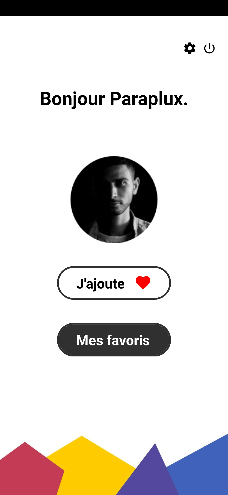
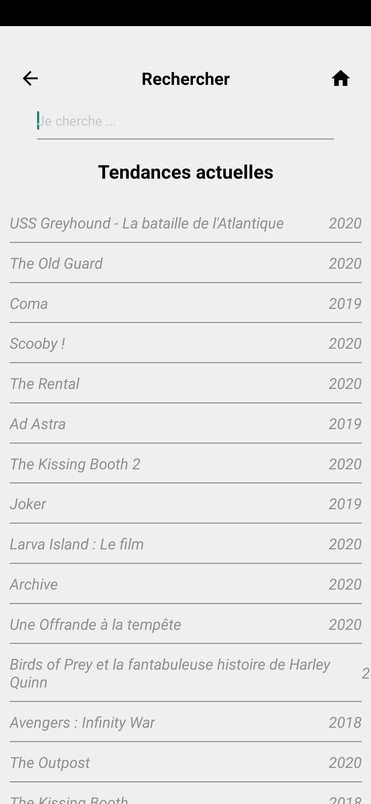
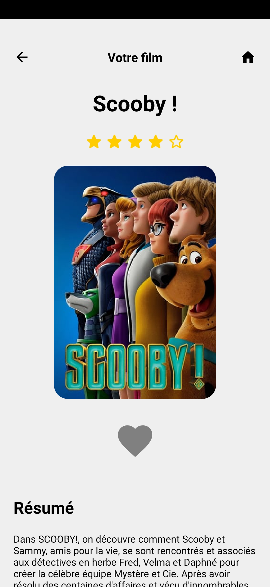

# Favorize repository

[](https://opensource.org/licenses/MIT)
[](https://expo.io/)
[](https://github.com/Paraplux/-LAB-Favorize/issues)

 - Name of this project : Favorize
 - Language : Javascript
 - Framework : React Native
 - Plateforme : Mobile
 - API : TMBD (The Movie DataBase / Personnal use) 

I'm still learning a lot about Javascript and I've always wanted to use it for anything else than web development. So I challenge myself to develop a mobile application in React Native.
My code won't be perfect (even if I'm trying to!), so feel free to correct me and give me advices, I'll appreciate it.

Favorize is a small application which aims to allow the management of favorite movies. 
It will call the TMBD API, display the results, and allow the users to save their favorite movies.
 
## Overview 

[Design](#design)

[Authentication](#Authentication)

[API](#api)

[Miscellaneous](#miscellaneous)


## Design

I was inspired by apple/spotify design, with round buttons, clear text, bold fonts, etc... I wanted the application to be as convenient as pretty.

### Screenshots





### Stylesheet
I'm using the Stylesheet abstraction


**./main/HomeScreen.js**
```javascript
...
const styles = StyleSheet.create({
    container: {
        backgroundColor: '#EFEFEF',
        paddingTop: 30,
        height: '100%',
    },
    movieTitle: {
        fontSize: 32,
        fontWeight: 'bold',
        textAlign: "center",
        marginVertical: 20
    },
    tileThumbContainer: {
        width: '60%',
        marginLeft: '20%',
        aspectRatio: 237/340
    },
    tileThumb: {
        width: '100%',
        height: '100%',
        resizeMode: 'cover',
        borderRadius: 20,
    },
    button: {
        marginTop: 30,
    },
    buttonFav: {
        color: '#303030',
    },
    boldFont: {
        fontWeight: 'bold',
        fontSize : 24
    },
    informations: {
        marginVertical: 30,
        paddingHorizontal: '5%'
    },
    informationsTitle: {
        marginVertical: 20,
        fontSize: 24,
        fontWeight: 'bold',
    }
})
...
```

## Authentication

At first, to authenticate users I've planned to use a JSON database, but after taking a look at Firebase, I've choosen the latter over the former.
Using Firebase was the guarantee of a simple and reliable database.
And, morevover, it allowed me to use Firestore to store the users favorite movies by creating a collection with the user id

Here's an example of how I create an user :

**./main/RegisterScreen.js**
```javascript
...
try {
    // Testing if the password are identicals
    if(this.state.password !== this.state.confirmPassword) {
        alert("Erreur de mot de passe")
    } else {
        firebase.auth().createUserWithEmailAndPassword(this.state.email.trim(), this.state.password).then(userCredentials => {
            ToastAndroid.show('Inscription réalisée avec succès', ToastAndroid.SHORT)
            
            this.firestore.collection('users').doc(userCredentials.user.uid).set({
                favs : []
            }).then(() => {
                // If all goes well, the user will be automatically connected by default
                // I just have to update the display name and redirect to Home Screen
                userCredentials.user.updateProfile({
                    displayName: this.state.displayName
                })
                this.navigation.navigate("Home")
            }).catch(error => {
                console.log(error)
            })
        }).catch((error) => {
            //Quick fix to translate error message to french for testing purpose
            if (error.toString() === "Error: Password should be at least 6 characters") {
                this.setState({errorMessage: "Le mot de passe doit contenir minimum 6 charactères."})
            } else if (error.toString() === "Error: The email address is already in use by another account.") {
                this.setState({errorMessage: "L'adresse email est déjà utilisée par un autre comtpe."})
            }
            console.log(error)
        })
    }
} catch(error) {
    console.log("Erreur inscription")
    alert(this.state.errorMessage)
}
...
```

You can take a look at both **LogScreen**, **LoginScreen** and **RegisterScreen** files for more informations.


## API

I've choosen TMBD API to get all the informations I needed about movies.


And for all the query I've used the axios package

[](https://github.com/axios/axios)


For example if I need to search for a particular movie :

**./main/SearchResults.js**
```javascript
...
searchMovie (query) {
    axios
    .get(`
    https://api.themoviedb.org/3/search/movie?api_key=040dff99eeba55116f8145fd1862aa4d&language=fr-FR&query=${query}&page=1&include_adult=false`)
    .then((response) => {
        this.setState({report: response.data.results})
    })
}
...
```

Or if I want the trending movies :

**./main/SearchScreen.js**
```javascript
...
trending () {
    axios
    .get(`
    https://api.themoviedb.org/3/discover/movie?api_key=040dff99eeba55116f8145fd1862aa4d&language=fr-FR&sort_by=popularity.desc&include_adult=false&include_video=false&page=1`)
    .then((response) => {
        this.setState({report: response.data.results})
    })
}
...
```


## Miscellaneous

### Figma 
The project sketch can be view on <a target="_blank" href="https://www.figma.com/file/PiJqBM1WzL43R7ZId55CPS/Favorize?node-id=0%3A1">Figma</a>


### Redux
I plan to use redux (to handle the favs), this is the next addition, which is in progress

Here's an example : 

**./store/reducers/ToggleFavorite.js**
```javascript
import * as firebase from 'firebase'
import 'firebase/firestore'
import '../../main/database/config.js'


const initialState = {
    connectedUser: undefined,
    movieFavs: []
}

function toggleFavorite(state = initialState, action) {
    const firestore = firebase.firestore()
    let nextState

    firebase.auth().onAuthStateChanged(function(user) {
        if (user) {
            var user = firebase.auth().currentUser;
            if(user != null){ 
                initialState.connectedUser = user.uid;
                firestore.collection('users').doc(initialState.connectedUser).get().then((response) => {
                    console.log(response.data().toggleFavorite)
                    initialState.movieFavs = response.data().toggleFavorite
                })
            }
        } else {
            // No user is signed in.
            console.log("No user signed in")
        }
    })

    switch (action.type) {
        case 'TOGGLE_FAVORITE':
            const movieFavsIndex = state.movieFavs.findIndex(item => item.id === action.value.id)
            if (movieFavsIndex !== -1) {
                nextState = {
                    ...state,
                    movieFavs: state.movieFavs.filter( (item, index) => index !== movieFavsIndex)
                }
            }
            else {
                nextState = {
                    ...state,
                    movieFavs: [...state.movieFavs, action.value]
                }
            }
            firestore.collection('users').doc(initialState.connectedUser).set({
                toggleFavorite: nextState.movieFavs || state.movieFavs
            })
            return nextState || state
    default:
        return state
    }
}

export default toggleFavorite
```

### License


<p style="text-align:center"><strong>MIT</strong></p>
<p style="text-align:center">Made with  ❤  by Marc Bouchez "Paraplux" - 2020</p>